**Eks Project - Usermanagement Microservice with Mysql** 

**database** 

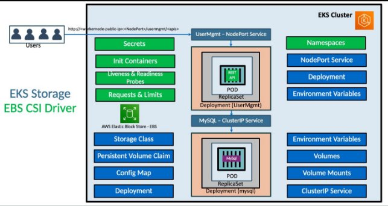

**• We are going to use EBS CSI Driver and use EBS Volumes for persistence storage to MySQL Database** 

**Kubernetes Important Concepts for Application Deployments** 

|Storage Class  - for persistant volume||
| - | :- |
|Persistent Volume Claim - to claim the volume||
|Config Map - config file for sql schema||
|Deployment, Environment Variables, Volumes, VolumeMounts||
|ClusterIP Service - for my sql server||
|Deployment, Environment Variables  - define db data||
|NodePort Service - for user managemant service||
|Secrets - for db password||
|Init Containers - it will wait for my sql pod to comeup then connect to usermgnt Microservice||
|Liveness & Readiness Probes - to check the pod status||
|Requests & Limits - for the pod limits||
|Namespaces - for the isolated resource to create||
|Resource quota - how much resource can be utilised in the namespace||

Create Cluster:

eksctl create cluster --name=eksdemo1 \

`                      `--region=us-east-1 \

`                      `--zones=us-east-1a,us-east-1b \                       --without-nodegroup 

eksctl utils associate-iam-oidc-provider \     --region us-east-1 \

`    `--cluster eksdemo1 \

`    `—approve

Create Public Node Group:   

eksctl create nodegroup --cluster=eksdemo1 \                        --region=us-east-1 \

`                       `--name=eksdemo1-ng-public1 \                        --node-type=t3.medium \

`                       `--nodes=2 \

`                       `--nodes-min=2 \

`                       `--nodes-max=4 \

`                       `--node-volume-size=20 \

`                       `--ssh-access \

`                       `--ssh-public-key=kube-demo \                        --managed \

`                       `--asg-access \

`                       `--external-dns-access \

`                       `--full-ecr-access \

`                       `--appmesh-access \

`                       `--alb-ingress-access 

In node-group security group allow all traffic and save

To Install ebs csi driver 

Create iam policy ec2 full access for ebs\_csi\_driver and attach to the node group iam role 

` `Deploy EBS CSI Driver

kubectl apply -k “github.com/kubernetes-sigs/aws-ebs-csi-driver/deploy/ kubernetes/overlays/stable/?ref=master"

Check the ebs csi driver pods installed in kube-system namespace

Kube manifests:


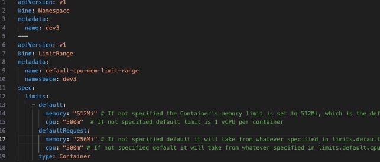

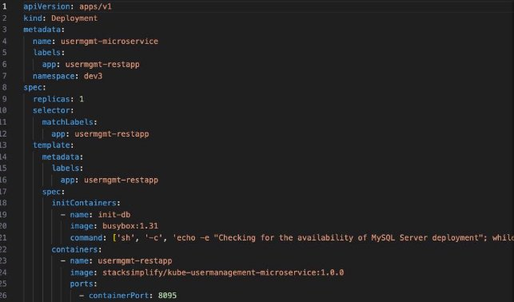

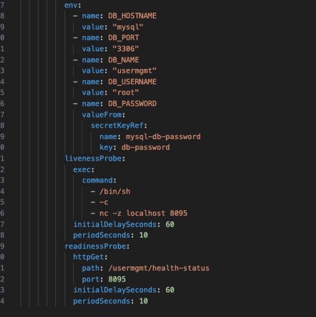

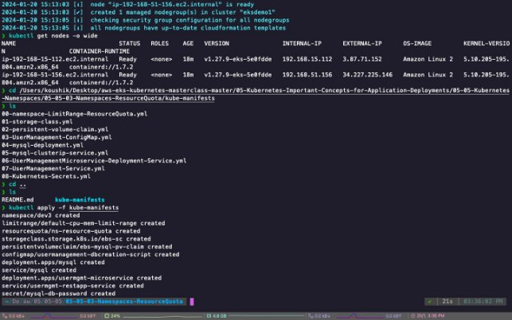

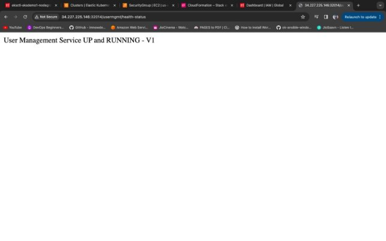

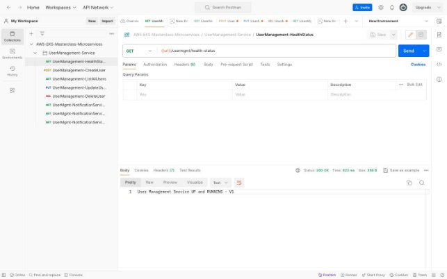

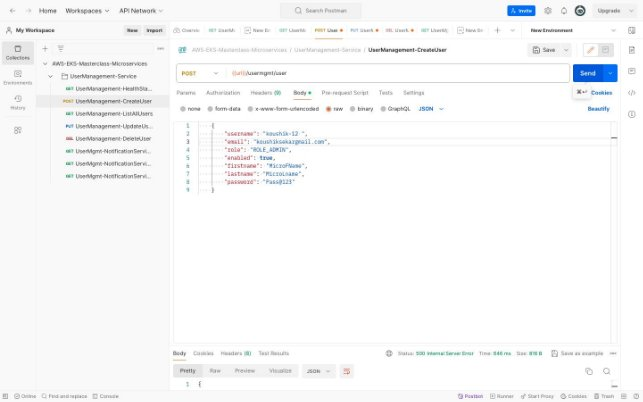

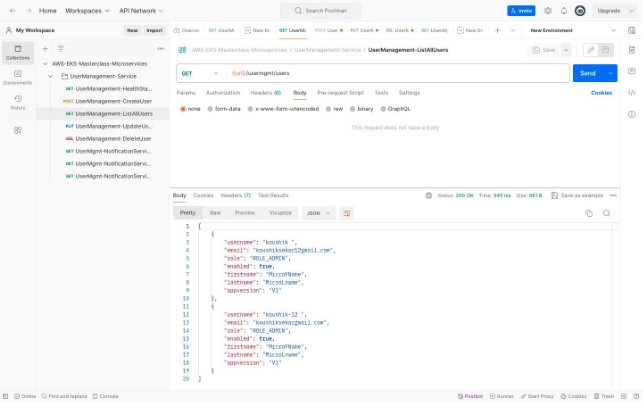

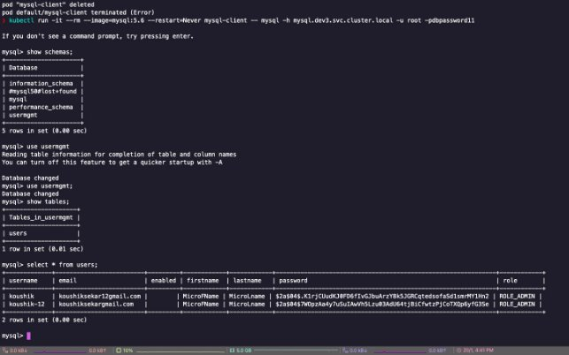

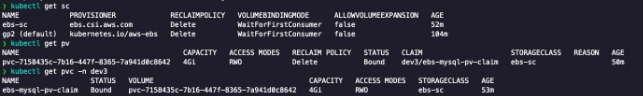

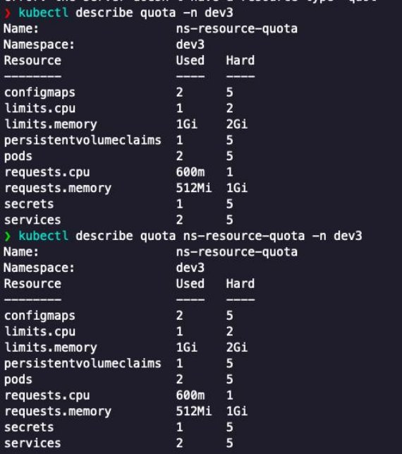

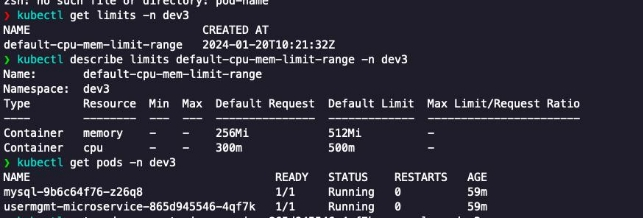

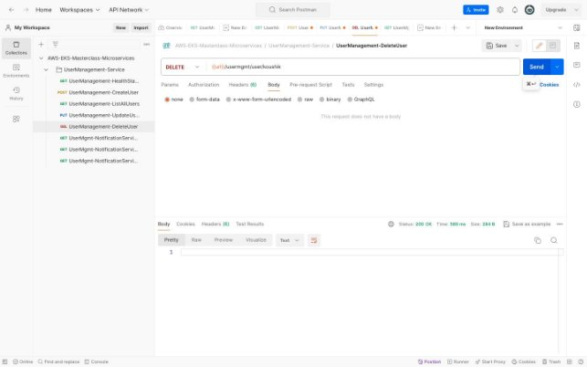

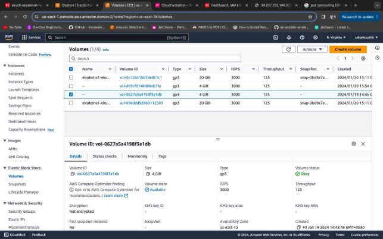
